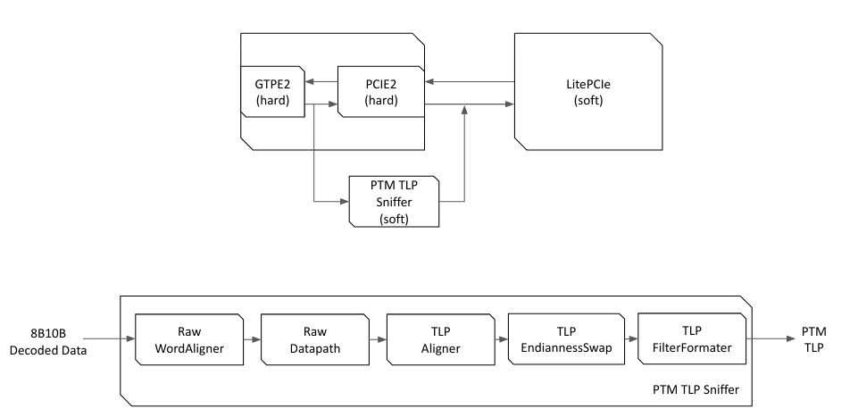

```
                   __   _ __      ___  _________        ___  ________  ___
                  / /  (_) /____ / _ \/ ___/  _/__ ____/ _ \/_  __/  |/  /
                 / /__/ / __/ -_) ___/ /___/ // -_)___/ ___/ / / / /|_/ /
                /____/_/\__/\__/_/   \___/___/\__/   /_/    /_/ /_/  /_/
                        LitePCIe PTM support / test repository.
                            Copyright (c) 2023 NetTimeLogic
                            Copyright (c) 2023 Enjoy-Digital
```

[> Intro
--------

The project provides PTM support/demo with LitePCIe on the TimeCard. The FPGA board is configured as a PTM Requester and a utilities/tests are provided to demonstrate correct operation.

To ease integration/maintenance, the PTM packets definition and Packetizer/Depacketizer modules are directly integrated in LitePCIe.

TODO: Add more info/diagram.

[> Prerequisites / System setup
-------------------------------
These are required in order to build and use the FPGA design and associated software provided in this project:
- Linux computer, PTM capable (Tested on Ubuntu 20.04).
- Python3, Xilinx Vivado installed.
- OCP-Tap TimeCard.
- JTAG-HS2 Cable.

[> Implementation note
----------------------

From our understanding of the Xilinx PHY and [question](https://support.xilinx.com/s/question/0D54U00007HkzneSAB/receive-all-message-tlps-on-user-interface-7-series-fpga-integrated-block?language=en_US) asked on Xilinx community forum, the Artix7's Xilinx PHY does not allow redirecting PTM TLP messages to the AXI interface. For a PTM Requester, this then prevent receving the PTM Response/ResponseD TLP messages.

To work-around this limitation, a PCIePTMSniffer has been implemented: The module is sniffing the RX Data between the GTPE2 and PCIE2 hardblocks and descrambling/decoding the PCIe traffic to re-generate the PTM TLPs.

The re-generated PTM TLPs can then be re-injected in to LitePCIe core and use it's PTM Depacketizer:



[> Run Unit-tests
-----------------
TODO: Add more info/diagram.
```sh
$ python3 -m unittest test.test_raw_sniffer
$ python3 -m unittest test.test_tlp_sniffer
```

[> Build and test design
------------------------
TODO: Add more info/diagram.
```sh
$ ./ocp_tap_timecard.py --csr-csv=csr.csv --build --load
$ Reboot PC with TimeCard.
$ litex_server --jtag
$ litescope_cli -r analyzer_state
```

[> Run PHC2SYS / PPS Demo
-------------------------

TimeCard -> Host regulation:
```sh
cd kernel
make clean all
sudo ./init.sh
sudo systemctl stop systemd-timesyncd.service
sudo phc_ctl /dev/ptp2 set
sudo phc2sys -c CLOCK_REALTIME -s /dev/ptp2 -O 0 -N1 -m
```

Host -> Intel I225 regulation:
```sh
sudo /bin/bash
echo 1 > /sys/class/ptp/ptp0/pps_enable
echo 2 0 > /sys/class/ptp/ptp0/pins/SDP0
echo '0 0 0 1 0' > /sys/class/ptp/ptp0/period
sudo phc2sys -s CLOCK_REALTIME -c /dev/ptp0 -O 0 -m
```

Insert a glitch in the regulation:
```sh
Ctrl-C on TimeCard phc2sys
sudo date -s XX:YY (a few seconds in the future)
sudo phc2sys -c CLOCK_REALTIME -s /dev/ptp2 -O 0 -N1 -m
```