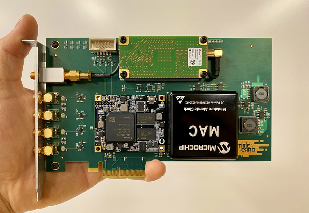
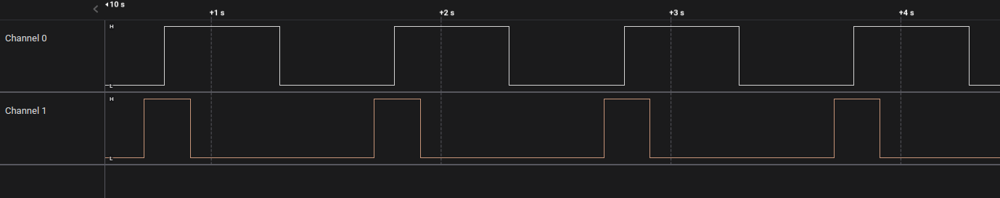

```
                   __   _ __      ___  _________        ___  ________  ___
                  / /  (_) /____ / _ \/ ___/  _/__ ____/ _ \/_  __/  |/  /
                 / /__/ / __/ -_) ___/ /___/ // -_)___/ ___/ / / / /|_/ /
                /____/_/\__/\__/_/   \___/___/\__/   /_/    /_/ /_/  /_/
                        LitePCIe PTM support / test repository.
                            Copyright (c) 2023 NetTimeLogic
                            Copyright (c) 2023 Enjoy-Digital
```

[> Intro
--------

The project provides PTM support/demo with LitePCIe on the TimeCard.



The FPGA board is configured as a PTM Requester and utilities/tests are provided to demonstrate correct operation.

To ease integration/maintenance, the PTM packet definitions and Packetizer/Depacketizer modules are directly integrated in [LitePCIe](https://github.com/enjoy-digital/litepcie).

This project provides:
- A PCIePTMSniffer module sniffing GTPE2 <-> PCIE2 traffic and generating PTM Responses. A PCIePTMInjector is not required since PTM Request are able to traverse the Xilinx PHY.
- A TimeGenerator module to generate a local time (in ns) and interface with the Linux driver.
- A PPSGenerator module to generate a PPS and allow external synchronization test with other PTM compatible boards.
- A LiteX design integrating LitePCIe with PTM support on the TimeCard.
- A Linux driver adding PTP/PTM support to LitePCIe driver.
- A demo application with phc2sys

As a demonstration of the work, an application has been prepared to synchronize the time of an Intel I225 Network Card to the time of the TimeCard through PTM/Linux/phc2sys utility with both boards generating a PPS and a logic analyzer/Scope observing the PPS:


[> Prerequisites / System setup
-------------------------------

These are required in order to build and use the FPGA design and associated software provided in this project:
- Linux computer, PTM capable (Tested with Ubuntu 20.04).
- Python3, Xilinx Vivado installed.
- LiteX [installed](https://github.com/enjoy-digital/litex/wiki/Installation#litex-installation-guide) and up to date (2023.09.22).
- An OCP-Tap TimeCard.
- An Intel I225 board.
- A JTAG-HS2 Cable.
- A Logic Analyzer/Scope to observe PPS.

[> Xilinx PHY workaround / Implementation note
----------------------------------------------

From our understanding of the Xilinx PHY and [question](https://support.xilinx.com/s/question/0D54U00007HkzneSAB/receive-all-message-tlps-on-user-interface-7-series-fpga-integrated-block?language=en_US) asked on Xilinx community forum, the Artix7's Xilinx PHY does not allow redirecting PTM TLP messages to the AXI interface. For a PTM Requester, this then prevent receiving the PTM Response/ResponseD TLP messages.

To work-around this limitation, a PCIePTMSniffer has been implemented: The module is sniffing the RX Data between the GTPE2 and PCIE2 hardblocks and descrambling/decoding the PCIe traffic to re-generate the PTM TLPs.

The re-generated PTM TLPs can then be re-injected in to LitePCIe core and use its PTM Depacketizer:


The Xilinx PHY however allow generating the PTM Requests from the AXI interface, so a PCIePTMInjector module hasn't been required.

[> Run Unit-tests
-----------------

Implementing the PCIePTMSniffer module required doing some hardware capture with Litescope of the GTPE2 <-> PCIE2 hardblock traffic. These raw captures have been used to create the descrambling/decoding logic and can be found in test directory.

These tests can be exectuted with:
```sh
$ python3 -m unittest test.test_raw_sniffer
$ python3 -m unittest test.test_tlp_sniffer
```

[> Build and test design
------------------------
The FPGA design can be build and tested with the following commands:

```sh
$ ./ocp_tap_timecard.py --csr-csv=csr.csv --build --load
$ Reboot the remote PC with the TimeCard.
$ litex_server --jtag
$ litescope_cli (for LiteScope use when design is built with a LiteScope analyzer probe)
$ ./test_time.py
$ ./test_ptm.py
```

[> Generate standalone LitePCIe standalone core with PTM support.
-----------------------------------------------------------------

LitePCIe's `.yml` configuration files can be reused and enabling PTM can be done by adding:
```yml
    # PTM ----------------------------------------------------------------------
    "ptm"                     : True, # Enable PTM support.
```

The standalone core can be generated with `litepcie_gen.py ocp_tap_timecard.yml` and when generated with PTM support, will expose 3 additional input IOs:

- time_clk: The Clk used for time generation.
- time_rst: The Rst used for time generation.
- time_ns: The time in nanoseconds (Time that will be used for internal PTM T1/T4 time sampling

Enabling PTM adds a PTMRequester module to the design, with its own registers. The use is demonstrated
in the provided Linux driver ('software/kernel').

[> Run PHC2SYS / PPS Demo
-------------------------

A demo application allows time synchronization of an Intel I225 Network Card to the time of the TimeCard through PTM/Linux/phc2sys , with both boards generating a PPS and a logic analyzer capturing both PPS to check synchronization:

Start **Host's CLOCK_REALTIME -> Intel I225's time** regulation:
```sh
$ sudo /bin/bash
$ echo 1 > /sys/class/ptp/ptp0/pps_enable
$ echo 2 0 > /sys/class/ptp/ptp0/pins/SDP0
$ echo '0 0 0 1 0' > /sys/class/ptp/ptp0/period
$ sudo phc2sys -s CLOCK_REALTIME -c /dev/ptp0 -O 0 -m
```


With this, both the TimeCard and Intel I225 boards are generating their PPS, as can be seen unaligned:



Start **TimeCard's time -> Host's CLOCK_REALTIME** regulation:
```sh
$ cd kernel
$ make clean all
$ sudo ./init.sh
$ sudo systemctl stop systemd-timesyncd.service
$ sudo phc_ctl /dev/ptp2 set
$ sudo phc2sys -c CLOCK_REALTIME -s /dev/ptp2 -O 0 -N1 -m
```

With this, `CLOCK_REALTIME` is now disciplined on TimeCard, Intel I225 on `CLOCK_REALTIME` and
PPS are now aligned:


PPS edges have also been observed with a scope to evaluate aligment offset/jitter:


Regulation with phc2sys introduces most of the jitter, which could probably be reduced by fine tuning
phc2sys's rate/KP/KI parameters.

An offset is also present and could be reduced to a minimal value by taking into account all hardware
delays in the regulation chain:
- Time resynchronization delay between TimeGenerator and PTMRequester.
- PPSGenerator delay between TimeGenerator and PPSGenerator.
- PCIe PHY logic TX/RX delays.
- Clocks drift/phase.

Since TimeGenerator and PPSGenerator modules are minimalist and created just for this demo application, it will
be more interesting to fine tune the offset/delays on the final application. The work done here and
the demo should provide a good basis for this.

Inserting a glitch in the regulation and observe correct re-alignement can be done by simply changing
the date of the system:

```sh
$ Ctrl-C on TimeCard phc2sys
$ sudo date -s XX:YY (a few seconds in the future)
$ sudo phc2sys -c CLOCK_REALTIME -s /dev/ptp2 -O 0 -N1 -m
```
